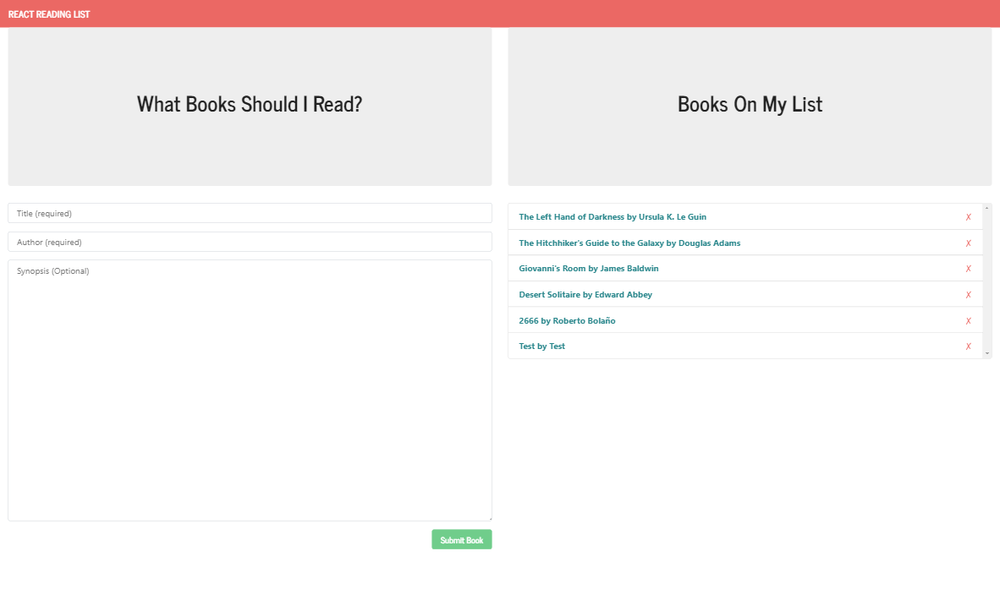
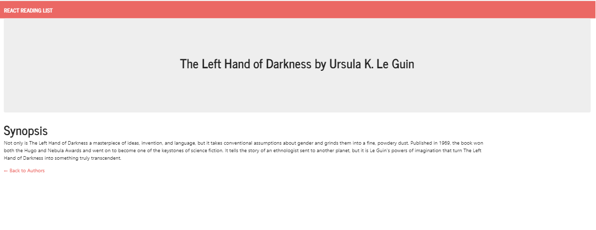

# Book-App-React

-This is a react reading list application. This sample code shows how to retrieve books from a database, submit and delete books from the database, and render a book details page using a router.

# Demo
Click here for a live demo via heroku ---> <a href="https://sample-book-app-react.herokuapp.com/"> https://sample-book-app-react.herokuapp.com/ </a> <-----
